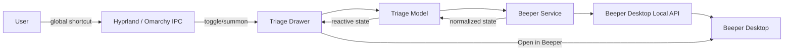
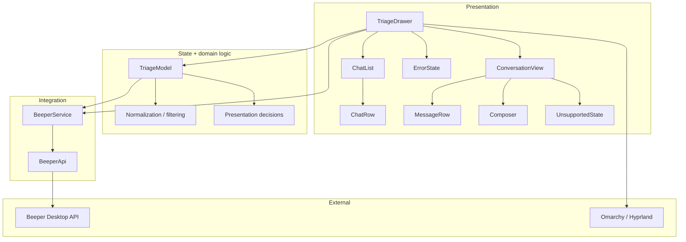
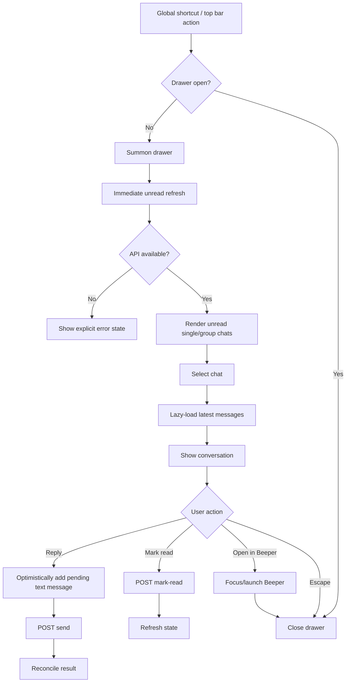
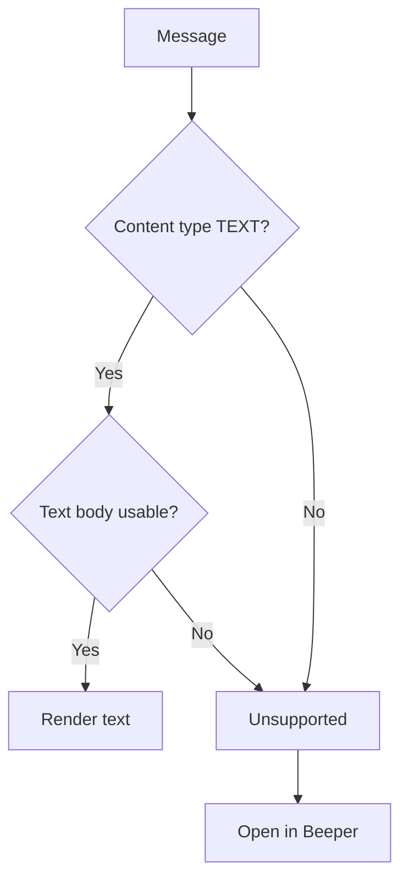
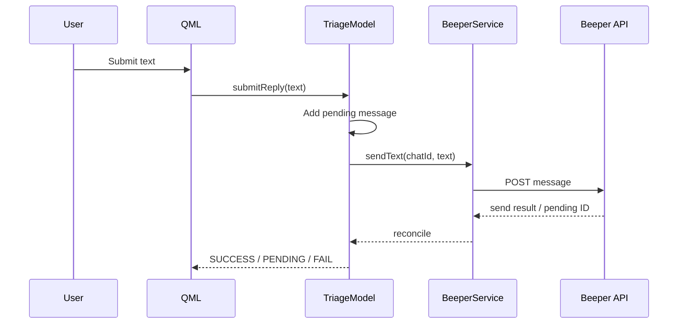
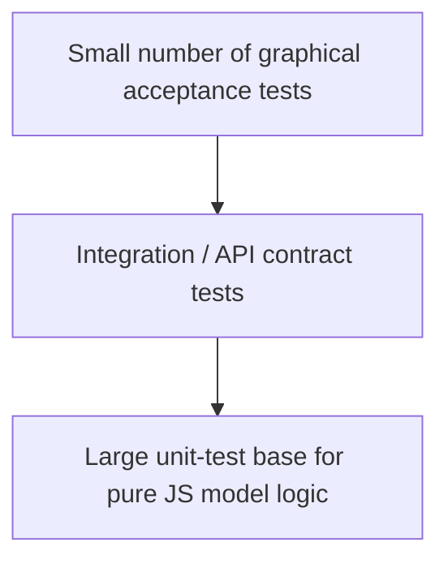

# Relay — Beeper Triage Drawer

**Status:** Draft implementation specification  
**Version:** 0.1  
**Target:** Omarchy Quattro + Quickshell 0.3.x  
**Backend:** Beeper Desktop local API  
**Working name:** Relay

---

## 1. Purpose

Relay is a native Omarchy Quickshell `panel` plugin that provides a lightweight, keyboard-first triage surface for unread Beeper conversations.

Its job is not to replace Beeper Desktop. Its job is to answer one question quickly:

> **Who needs my attention right now, and can I handle it in one or two actions?**

Relay exposes unread direct messages and standard group chats, shows the latest relevant plain-text messages, permits short text replies, marks chats read, and provides an escape hatch into the full Beeper Desktop application for anything outside the MVP's content model.

Relay must remain small, fast, transient, and safe to leave running for an entire desktop session.

---

## 2. Product Scope

### 2.1 In scope

| Area | MVP behavior |
|---|---|
| Chat types | Direct messages (`single`) and group chats (`group`) |
| Message display | Plain text messages |
| Unread discovery | Only chats with unread messages |
| Conversation view | Latest small window of messages; no history/search |
| Sending | Plain text message |
| Read state | Mark chat read through a specific message when available |
| Drawer | Summon/hide from Omarchy shell |
| Keyboard | Full primary workflow without mouse |
| Full client escape hatch | Open/focus Beeper Desktop |
| Synchronization | Local API reconciliation while drawer is active, plus refresh after mutations |
| Error handling | Explicit unavailable/loading/error states |

### 2.2 Explicitly out of scope for MVP

- Channels, broadcast lists, communities, or equivalent non-`single`/`group` surfaces
- Attachments and media sending
- Rendering images, videos, audio, files, stickers, locations, or reactions
- Historical search
- Creating chats
- Contact management
- Group administration
- Message editing/deletion
- Reactions
- Voice notes
- Rich text editing
- Draft synchronization
- Full notification-center behavior
- Cross-device or remote Beeper API access
- Running without Beeper Desktop

### 2.3 Product boundary

If a message cannot be represented faithfully as plain text, Relay must not attempt to emulate the full Beeper renderer. It must present an `unsupported` state and offer **Open in Beeper**.

---

## 3. Design Principles

1. **Triage, not replacement.** Relay must always be less capable than Beeper Desktop.
2. **Keyboard first.** Mouse input is secondary; every core action must have a keyboard path.
3. **Transient UI.** The drawer is a summoned surface, not a permanent application window.
4. **Lazy work.** Fetch the minimum data needed for the current screen.
5. **Event/state separation.** API access and normalization are isolated from QML presentation.
6. **Explicit failure.** API failure must never look like an empty inbox.
7. **Long-lived process safety.** The plugin runs inside Omarchy's single long-running Quickshell process and must tolerate external resources appearing/disappearing.
8. **Theme-native.** Relay consumes Omarchy theme semantics rather than hard-coding an independent palette.
9. **Small dependency surface.** Prefer built-in Quickshell/Omarchy facilities and the local Beeper API; avoid additional daemons unless a real requirement emerges.

---

## 4. Runtime Architecture

Omarchy Quattro runs the desktop as a single long-lived Quickshell process. Third-party plugins belong under `~/.config/omarchy/plugins/<id>/`; a plugin declares a manifest and one or more plugin kinds. A `panel` is the correct plugin kind for a summoned persistent floating surface.  

### 4.1 System architecture



### 4.2 Internal layering



### 4.3 Dependency rule

Dependencies flow downward only:

```text
QML components
    ↓
TriageModel
    ↓
BeeperService
    ↓
BeeperApi
    ↓
HTTP / Beeper Desktop
```

UI components must not construct HTTP requests, parse Beeper response shapes, spawn Beeper CLI processes, or perform domain filtering.

---

## 5. Beeper Integration

Beeper Desktop exposes a local API while Beeper Desktop is running. The API is intended for local integrations and supports JavaScript, Python, Go, PHP, and direct REST usage.

### 5.1 Required endpoints

| Purpose | Endpoint | Required behavior |
|---|---|---|
| Discover unread chats | `GET /v1/chats/search` | `unreadOnly=true`, `type=any` or separate `single`/`group`; discard anything not `single`/`group` |
| Fetch conversation | `GET /v1/chats/{chatID}/messages` | Lazy-load only when chat is selected |
| Send message | `POST /v1/chats/{chatID}/messages` | Send plain text only |
| Mark read | `POST /v1/chats/{chatID}/read` | Prefer marking through a known message ID |

The chat search API supports `type=single|group|any` and `unreadOnly=true`. The returned chat includes `id`, `type`, `unreadCount`, title/network information, and an optional last-message `preview`.  

The message API exposes a cursor-based message list. Message objects expose content `type`, optional `text`, attachments, sender information, timestamps, unread state, and send status. `TEXT` is the supported MVP content type.  

The send endpoint accepts text and returns a send response suitable for representing a pending/queued send before reconciliation. Mark-read accepts an optional message ID. 

### 5.2 API access strategy

**Primary implementation:** direct local HTTP API.

Do **not** use the `beeper-desktop` CLI as the normal transport layer. The CLI can be useful during manual debugging but must not sit between QML and the API in production code.

Rationale:

- avoids subprocess creation for every action;
- avoids stdout/stderr parsing;
- removes shell quoting concerns;
- provides explicit HTTP error handling;
- maps directly to the documented API contract.

### 5.3 Authentication

The implementation must use the Beeper Desktop API authentication mechanism documented by Beeper. The access token must be treated as a secret and must never be committed, displayed, logged, or placed in QML source.

The implementation should isolate token acquisition/storage from the UI layer. Prefer existing Beeper/desktop configuration mechanisms over inventing a new credential store.

---

## 6. Data Model

Relay defines a normalized model so the UI does not depend on the full Beeper object graph.

### 6.1 `TriageChat`

```text
TriageChat
├── id: string
├── title: string
├── network: string
├── type: "single" | "group"
├── avatarUrl: string | null
├── unreadCount: integer >= 0
├── lastActivity: datetime | null
├── preview: TriageMessage | null
├── messagesLoaded: boolean
└── isReadOnly: boolean
```

### 6.2 `TriageMessage`

```text
TriageMessage
├── id: string
├── chatId: string
├── senderId: string
├── senderName: string
├── timestamp: datetime
├── isMine: boolean
├── isUnread: boolean | null
├── kind: "text" | "unsupported"
├── text: string | null
└── sendState: "remote" | "pending" | "failed-retriable" | "failed-permanent"
```

### 6.3 `TriageState`

```text
TriageState
├── status: "idle" | "loading" | "ready" | "error"
├── error: "beeper-unavailable" | "unauthorized" | "rate-limited" | "server-error" | "invalid-response" | "unknown" | null
├── chats: TriageChat[]
├── activeChatId: string | null
├── lastRefreshAt: datetime | null
├── refreshing: boolean
└── unreadTotal: integer >= 0
```

---

## 7. Public Interfaces

Interfaces are deliberately narrow. Concrete implementation may change; callers should depend only on these contracts.

### 7.1 `BeeperApi`

```javascript
// Pure integration boundary; no UI concerns.

async function searchUnreadChats(options): Promise<BeeperChatPage>;

async function listMessages(chatId, options): Promise<BeeperMessagePage>;

async function sendText(chatId, text, options): Promise<BeeperSendResult>;

async function markRead(chatId, messageId = null): Promise<BeeperChat>;
```

`options` must be an object so new API parameters can be added without changing positional call sites.

### 7.2 `BeeperService`

```text
properties:
    status
    chats
    activeChat
    lastRefreshAt
    lastError
    pollingActive

methods:
    initialize()
    refreshUnread()
    loadMessages(chatId)
    sendText(chatId, text)
    markRead(chatId, messageId)
    retry()
    stopPolling()

signals:
    stateChanged
    refreshStarted
    refreshFinished
    sendStarted(chatId, localMessageId)
    sendFinished(chatId, localMessageId)
    errorChanged
```

The service owns transport state, retries/backoff, request de-duplication, and normalization. It must not manipulate focus, animation, or visual state.

### 7.3 `TriageModel`

The model is the boundary between service data and presentation.

```text
properties:
    chats
    activeChatId
    activeMessages
    unreadTotal
    status
    error

methods:
    selectChat(chatId)
    closeChat()
    refresh()
    submitReply(text)
    markActiveChatRead()
    openInBeeper(chatId)
```

Pure helper functions should live in JS modules where practical:

```javascript
filterEligibleChats(chats)
normalizeChat(chat)
normalizeMessage(message)
classifyMessage(message)
sortChats(chats)
appendPendingMessage(messages, pending)
reconcilePendingMessage(messages, remote)
```

These functions should be independently testable without launching Quickshell.

### 7.4 `TriageDrawer.qml`

```qml
// Public surface expected by the Omarchy panel plugin.

property bool open
property int selectedIndex

signal requestClose()
signal requestOpenInBeeper(string chatId)
```

Responsibilities:

- layout and animation;
- focus handling;
- keyboard navigation;
- composition of visual components;
- calling `TriageModel` methods.

It must not know Beeper REST paths or response schemas.

### 7.5 Component contracts

```text
ChatList
    input: TriageChat[]
    input: selectedIndex
    output: chatActivated(index)

ChatRow
    input: TriageChat
    input: selected: bool
    output: clicked()

ConversationView
    input: TriageChat
    input: TriageMessage[]
    output: requestMarkRead()
    output: requestOpenInBeeper()

MessageRow
    input: TriageMessage

Composer
    input: enabled: bool
    input: busy: bool
    output: submit(text)

UnsupportedMessage
    input: message
    output: openInBeeper()

ErrorState
    input: error
    output: retry()
```

---

## 8. Plugin Contract

Relay should be a user-owned Omarchy plugin and initially expose a `panel` kind only.

Example manifest shape:

```json
{
  "schemaVersion": 1,
  "id": "yourname.relay",
  "name": "Relay",
  "version": "0.1.0",
  "author": "Your Name",
  "description": "Keyboard-first unread Beeper triage drawer.",
  "kinds": ["panel"],
  "entryPoints": {
    "panel": "TriageDrawer.qml"
  }
}
```

The permanent ID must be namespaced and stable. Do not use an `omarchy.*` ID for a third-party plugin.

Start development in:

```text
~/.config/omarchy/plugins/<id>/
```

Use `omarchy plugin validate` before enabling/publishing.

Do not modify packaged Omarchy source for ordinary plugin development.

---

## 9. Interaction Specification

### 9.1 Core flow



### 9.2 Default keyboard map

The exact global binding is configurable at the Omarchy/Hyprland level. The plugin itself must support these local interactions:

| Key | Action |
|---|---|
| `Esc` | Close drawer / return from conversation to list |
| `↑` / `↓` | Move selected chat or focus within active list |
| `Enter` | Open selected chat |
| `Ctrl+Enter` | Send composer text |
| `Ctrl+O` | Open/focus Beeper |
| `Ctrl+R` | Refresh unread state |
| `Tab` / `Shift+Tab` | Move focus across controls |

The application must avoid hard-coding a key combination that conflicts with normal text entry unless the key is modifier-qualified.

### 9.3 Read semantics

Opening a chat and closing the drawer are different operations from marking the chat read.

Recommended MVP behavior:

- selecting a chat does not implicitly mark every message in the conversation read;
- the service should mark through the most recently displayed/known message when the user explicitly invokes mark-read or when the agreed product behavior says that viewing constitutes reading;
- closing the drawer alone must not mark unrelated chats read.

The initial implementation should expose a dedicated model action `markActiveChatRead()` so the policy remains changeable without touching the API layer.

### 9.4 Dismiss/close terminology

Use **Close** for the drawer action.

Do not use **Dismiss** unless the product implements a separate semantic state meaning "hide this chat for now". MVP does not implement that state.

---

## 10. Refresh and Polling Strategy

Polling is reconciliation, not the source of truth for rendering.

### 10.1 Rules

| Situation | Behavior |
|---|---|
| Shell/plugin initialization | Initialize service; do not aggressively loop |
| Drawer opens | Refresh immediately |
| Drawer open | Poll approximately every 2–5 seconds initially; make interval configurable internally |
| Drawer closes | Stop aggressive polling |
| Send completes | Refresh immediately or reconcile then refresh |
| Mark read completes | Refresh immediately |
| Request fails | Enter explicit error state and apply bounded backoff |
| Drawer reopens after idle | Refresh immediately |

The final polling interval should be validated against real Beeper behavior rather than treated as a contractual API value.

### 10.2 Request de-duplication

At most one unread-chat refresh may be active at a time.

At most one message-load operation per `chatId` may be active at a time.

A new refresh request while one is active should either coalesce into the current request or schedule exactly one follow-up refresh; do not create an unbounded queue.

### 10.3 Pagination

The chat list should normally use a small limit because the UI only needs the current unread queue.

The conversation view should request only a bounded recent window. Do not recursively page through complete history.

The UI must not attempt to inspect or manipulate opaque Beeper cursors; pass them through the API abstraction only when needed.

---

## 11. Message Classification

Beeper message objects contain a `type` and may contain text, attachments, link previews, reactions, and other fields.

The MVP renderer must use a deliberately small classifier:

```text
TEXT + usable text body
    → text
anything else materially requiring unsupported rendering
    → unsupported
```

Do not infer support from the presence of a URL, attachment metadata, or a preview. A message containing media remains unsupported even if a text caption is available unless the product explicitly defines caption-only support later.

### 11.1 Rendering rule



---

## 12. Send Semantics

Sending must be optimistic.



The UI must support at least these visible states:

```text
pending
success / remote
failed-retriable
failed-permanent
```

Internal Beeper diagnostic error strings must not be shown verbatim if they may contain implementation detail. Map transport/provider failures to user-safe messages and log diagnostic context separately when appropriate.

---

## 13. Error Handling

### 13.1 Required distinction

These states are not equivalent:

```text
NO_UNREAD_MESSAGES
BEEPER_UNAVAILABLE
UNAUTHORIZED
INVALID_RESPONSE
REQUEST_FAILED
```

Never turn transport failure into `chats = []` without preserving error state.

### 13.2 User-visible states

**Loading**

```text
Loading…
```

**Empty**

```text
No unread messages
```

**Unavailable**

```text
Beeper is unavailable.
Start Beeper Desktop and retry.
```

**Send failure**

```text
Message failed to send.
Retry
```

### 13.3 Backoff

Retries must be bounded.

Recommended policy:

```text
initial retry delay: ~1s
exponential backoff
cap: ~30–60s
reset after successful request
```

Exact constants are implementation details and should live in one configuration/module.

---

## 14. Opening Beeper

Relay's full-client escape hatch must not assume that a single Beeper window always exists.

Preferred behavior:

1. request Beeper Desktop to become the active application using the safest available local desktop/Omarchy mechanism;
2. if Beeper is not running, launch it using the normal Omarchy/application-launch mechanism;
3. close Relay after the handoff succeeds or after the launch/focus command has been issued.

Keep desktop-process handling isolated in one helper. Do not distribute `hyprctl` invocations across UI components.

---

## 15. UI Specification

### 15.1 Visual goal

Relay should feel like a transient layer pulled out of the desktop, not a second messaging application.

Visual hierarchy should rely first on:

- spacing;
- typography;
- contrast;
- opacity;
- selection state;
- alignment.

Use borders, shadows, large radii, and gradients sparingly.

### 15.2 Recommended structure

```text
┌─────────────────────────────────────────────┐
│ Relay                                  4    │
├─────────────────────────────────────────────┤
│                                             │
│ ● Alice                               2     │
│   Can you look at this when you have…      │
│                                             │
│ ● Dev Team                            1     │
│   Deployment is ready                       │
│                                             │
│ ● Mom                                  1    │
│   Dinner at 8?                              │
│                                             │
└─────────────────────────────────────────────┘
```

Conversation:

```text
┌─────────────────────────────────────────────┐
│ ← Alice                         Beeper ↗    │
├─────────────────────────────────────────────┤
│                                             │
│ Alice                                       │
│ Can you review this?                        │
│                                             │
│ You                                         │
│ Sure, give me 10 minutes.                   │
│                                             │
├─────────────────────────────────────────────┤
│ Reply…                              Ctrl+Enter│
└─────────────────────────────────────────────┘
```

### 15.3 Geometry

Use screen-relative sizing rather than a rigid desktop-specific size.

Initial target:

```text
width: approximately 380–460 px
height: available screen height minus intentional margins
```

These numbers are starting points, not contractual requirements.

### 15.4 Motion

Use short, consistent transitions.

Suggested system:

```text
micro:    100–140 ms
standard: 160–220 ms
large:    250–350 ms
```

Drawer opening/closing should use one consistent motion model. Do not animate every child independently unless it materially improves comprehension.

### 15.5 Theme integration

Create semantic theme roles:

```text
background
surface
surfaceRaised
border
textPrimary
textSecondary
textDisabled
accent
success
warning
error
```

Create shared metrics:

```text
spacingXS / SM / MD / LG / XL
radiusSM / MD / LG
barHeight
animationFast / Normal / Slow
```

QML components must consume these semantic roles and metrics rather than raw palette values.

Relay should adapt to the active Omarchy theme instead of introducing a second global theme system.

---

## 16. Repository Structure

Recommended initial repository:

```text
relay/
├── manifest.json
├── README.md
├── LICENSE
│
├── TriageDrawer.qml
│
├── components/
│   ├── ChatList.qml
│   ├── ChatRow.qml
│   ├── ConversationView.qml
│   ├── MessageRow.qml
│   ├── Composer.qml
│   ├── UnsupportedMessage.qml
│   ├── EmptyState.qml
│   └── ErrorState.qml
│
├── services/
│   ├── BeeperService.qml
│   └── BeeperApi.js
│
├── models/
│   ├── TriageModel.qml
│   └── TriageModel.js
│
├── theme/
│   ├── RelayTheme.qml
│   └── RelayMetrics.qml
│
└── tests/
    ├── beeper-api.test.js
    ├── triage-model.test.js
    ├── message-classification.test.js
    └── fixtures/
        ├── chats.json
        ├── messages.json
        └── errors.json
```

The exact split may change during implementation, but the architectural boundaries must remain.

---

## 17. TDD Strategy

Development follows **red → green → refactor**. The key rule is that domain behavior is made testable outside the graphical shell wherever possible.

Omarchy's own Quattro tests use plain JavaScript modules that can be imported by QML and executed by Node, reserving compositor-dependent testing for things that genuinely require a live desktop. Relay should copy that strategy.

### 17.1 Test pyramid



### 17.2 Layer 1 — Pure unit tests

Write tests first for:

```text
filterEligibleChats
normalizeChat
normalizeMessage
classifyMessage
sortChats
calculateUnreadTotal
selectPreview
appendPendingMessage
reconcilePendingMessage
mapApiError
```

These tests must run without:

- Quickshell;
- Wayland;
- Hyprland;
- Beeper Desktop;
- real network access.

Use static JSON fixtures and deterministic inputs.

### 17.3 Layer 2 — API contract tests

Test the `BeeperApi` boundary against a fake/stub HTTP server.

Required cases:

```text
GET unread chats → valid result
GET unread chats → empty result
GET unread chats → HTTP error
GET unread chats → malformed JSON
GET messages → valid result
POST send → success
POST send → retriable failure
POST send → permanent failure
POST read → success
POST read → failure
request timeout
```

Do not make CI depend on a live Beeper account.

### 17.4 Layer 3 — Service tests

Verify that `BeeperService`:

- coalesces duplicate refreshes;
- normalizes API data;
- exposes explicit loading/error states;
- stops polling when inactive;
- restarts/retries after recoverable failures;
- reconciles pending sends;
- refreshes after mutations;
- does not erase known state on an error unless policy explicitly requires it.

### 17.5 Layer 4 — QML/component tests

Keep graphical testing focused on behavior that cannot be proven by pure model tests:

- opening/closing the drawer;
- focus behavior;
- keyboard navigation;
- composer focus;
- visual state switching;
- animation presence;
- panel lifecycle;
- integration with Omarchy IPC.

Use a live compositor only where necessary.

### 17.6 Layer 5 — Manual acceptance / visual verification

Before every release, verify:

```text
Beeper running / not running
0 unread / 1 unread / many unread
single chat / group chat
text / unsupported message
send success / send failure
mark-read success / failure
open Beeper
shell restart
plugin disable / enable
monitor add/remove
sleep / resume
network loss / recovery
```

Visual changes must be checked in the running desktop rather than assumed correct from code inspection.

### 17.7 TDD example

Feature: filter chats for the triage list.

**Red**

```javascript
assertDeepEqual(
  filterEligibleChats([
    { type: 'single', unreadCount: 2 },
    { type: 'group', unreadCount: 1 },
    { type: 'single', unreadCount: 0 }
  ]),
  [
    { type: 'single', unreadCount: 2 },
    { type: 'group', unreadCount: 1 }
  ]
);
```

**Green**

Implement the minimum filter.

**Refactor**

Extract eligibility rules into a named pure function and add tests for malformed/missing fields.

This pattern should be followed for all non-trivial behavior.

---

## 18. Cyclomatic Complexity Constraints

Cyclomatic complexity is a quality gate, not a suggestion. The objective is to keep individual functions understandable, testable, and easy to modify.

### 18.1 Hard limits

**General rule:**

```text
C <= 8  required for normal code
C  9–10 allowed only with clear justification
C > 10 prohibited
```

### 18.2 Stricter limits by layer

| Layer | Target | Hard maximum |
|---|---:|---:|
| Pure JS domain/model function | 1–5 | 8 |
| Beeper API adapter function | 1–4 | 8 |
| Service orchestration method | 1–6 | 10 |
| QML event handler | 1–3 | 5 |
| UI formatting/helper function | 1–4 | 6 |

A function exceeding its hard maximum must be refactored before merge.

### 18.3 Counting rules

Use standard McCabe cyclomatic complexity:

```text
C = 1 + number of independent decision points
```

For project review, count at least:

- `if` / `else if` branches;
- loops;
- `switch` cases;
- ternary expressions;
- exception branches;
- logical `&&` / `||` expressions when they materially create separate execution paths.

Because tooling differs in how boolean operators are counted, the project must use one fixed analyzer for automated gating and apply manual review to any borderline function.

### 18.4 Structural rules associated with complexity

- No function should contain more than two nested control-flow levels without strong justification.
- No QML event handler should become a business-logic function. Extract decisions into model/service helpers.
- Replace repeated branching on message/chat type with explicit classifiers or dispatch tables.
- Avoid giant `switch` blocks for message types when only `text` vs `unsupported` is needed.
- Prefer guard clauses over deeply nested `if` trees.
- Prefer one responsibility per function.
- When a function needs more than ~8 independent paths, split the behavior before adding more cases.

### 18.5 Complexity review example

Bad:

```javascript
function handleResponse(response, state, activeChat, retryCount) {
    if (...) {
        if (...) {
            if (...) {
                ...
            } else if (...) {
                ...
            }
        } else {
            ...
        }
    } else if (...) {
        ...
    } else if (...) {
        ...
    }
}
```

Preferred:

```javascript
const result = classifyResponse(response);
const nextState = transitionState(state, result);
return reconcileChatState(nextState, activeChat);
```

Each decision becomes independently testable.

---

## 19. Static Quality Gates

A pull request is not complete until all applicable gates pass.

### Required

```bash
omarchy plugin validate ./
qmllint ...
node tests/...
```

The repository should eventually expose a single entry point:

```bash
make check
```

which runs:

```text
1. manifest validation
2. QML lint
3. JS unit tests
4. API contract tests
5. complexity check
6. formatting / static checks
```

### CI principles

CI must not require:

- a real Wayland compositor;
- a running Hyprland session;
- Beeper Desktop;
- real messaging accounts;
- unrestricted network access.

Graphical acceptance tests should be a separate job/environment.

---

## 20. Long-Lived Process / Reliability Requirements

Relay executes inside the long-running Omarchy shell process. It must therefore be designed as infrastructure, not as a disposable application.

### Required lifecycle cases

```text
plugin load
plugin unload
shell restart
Beeper exits
Beeper starts
Beeper becomes temporarily unavailable
API returns malformed data
active chat disappears
active chat changes type/state
monitor disappears/reappears
Wayland/compositor restart
system suspend/resume
```

External QObject/reference lifetimes must not be assumed stable. UI code should avoid retaining references to objects that may be invalidated by the underlying service.

Do not launch a second Quickshell instance for Relay.

---

## 21. Security and Privacy

Relay handles private message content and API credentials.

Requirements:

- never log message bodies by default;
- never log access tokens;
- never write credentials to the repository;
- never send Beeper traffic to a remote relay/service;
- use localhost/API transport only;
- avoid unnecessary filesystem writes;
- do not interpret message text as QML/HTML markup unless a future feature explicitly requires safe parsing;
- treat all API content as untrusted input;
- sanitize or render message text as plain text.

The plugin runs unsandboxed with the user's permissions because that is the current Omarchy plugin model. Install only code that is trusted.

---

## 22. Performance Requirements

Relay is a desktop shell component and must be cheap while idle.

### Targets

- No continuous high-frequency polling while the drawer is closed.
- No full message-history downloads for the chat list.
- No duplicate concurrent refresh requests.
- No unnecessary subprocess creation for API requests.
- No blocking filesystem/network operation on the UI thread.
- Lazy-load conversation messages.
- Reuse components and models instead of repeatedly rebuilding the entire scene.

Quickshell provides lazy-loading mechanisms for UI that is not immediately needed; use them for sufficiently expensive secondary surfaces rather than instantiating all optional content eagerly.

---

## 23. Development Workflow

### 23.1 Start from a comparable Omarchy plugin

Use a first-party panel or another plugin with similar summon/open/close behavior as the structural reference. The goal is to copy the **runtime contract and conventions**, not another project's visual design.

### 23.2 Development loop

```text
edit
 ↓
qmllint / unit test
 ↓
omarchy plugin validate
 ↓
run/reload
 ↓
keyboard test
 ↓
visual test
 ↓
commit
```

Quickshell hot reload should be used during development where possible; when testing the final runtime behavior, also verify normal Omarchy shell restart behavior.

### 23.3 Commit structure

Prefer small, behavior-oriented commits:

```text
feat(model): normalize Beeper chats
feat(api): add unread chat search
feat(ui): add chat list
feat(ui): add conversation view
feat(send): add optimistic composer
fix(service): preserve state on refresh failure
refactor(model): split message classification
```

Avoid mixing large visual rewrites with transport changes in the same commit.

---

## 24. Implementation Milestones

### M0 — Skeleton

Deliver:

- valid Omarchy manifest;
- panel entry point;
- summon/hide lifecycle;
- empty visual surface;
- `make check` skeleton.

### M1 — Read-only triage

Deliver:

- Beeper API adapter;
- unread chat search;
- `single` / `group` filtering;
- normalized chat model;
- chat list UI;
- loading/empty/error states.

### M2 — Conversation view

Deliver:

- lazy message retrieval;
- text/unsupported classification;
- conversation UI;
- keyboard navigation;
- Open in Beeper.

### M3 — Sending and read state

Deliver:

- composer;
- optimistic send;
- failure/retry handling;
- explicit mark-read behavior.

### M4 — Reliability and polish

Deliver:

- polling/backoff;
- deduplication;
- theme integration;
- long-session lifecycle tests;
- visual acceptance coverage;
- complexity/static quality gates.

### M5 — Optional distribution

Only after the MVP is stable:

- documentation;
- screenshots;
- public repository cleanup;
- plugin marketplace submission;
- versioned releases.

---

## 25. Future Extension Points

The architecture may later support:

```text
bar widget unread count
additional quick actions
configurable shortcut
configurable polling interval
message search
rich-text rendering
additional message types
multiple communication backends
```

These are extension points only. They are not MVP requirements.

A future service kind may be justified if other Omarchy components need shared Beeper state. Do not introduce a separate service plugin until that requirement exists.

---

## 26. Documentation and References

### Omarchy

- [Omarchy shell plugins — official Quattro architecture](https://github.com/basecamp/omarchy/blob/quattro/manual/32-shell-plugins.md)
- [Omarchy first-party shell plugins](https://github.com/basecamp/omarchy/blob/quattro/shell/plugins/README.md)
- [Omarchy shell development guide](https://github.com/omacom/omarchy/blob/quattro/agents/skills/shell-dev.md)
- [Omarchy plugin development guide](https://plugins.omarchy.org/develop.html)
- [Omarchy testing guide](https://github.com/omacom/omarchy/blob/quattro/docs/testing.md)
- [Omarchy plugin publishing](https://plugins.omarchy.org/publish.html)
- [Omarchy plugin marketplace](https://plugins.omarchy.org/)

### Quickshell

- [Quickshell usage guide](https://quickshell.org/docs/v0.3.0/guide/)
- [QML language guide](https://quickshell.org/docs/v0.3.0/guide/qml-language/)
- [Quickshell `Quickshell` type](https://quickshell.org/docs/v0.3.1/types/Quickshell/Quickshell/)
- [Quickshell `Singleton`](https://quickshell.org/docs/types/Quickshell/Singleton/)
- [Quickshell `Process`](https://quickshell.org/docs/v0.2.0/types/Quickshell.Io/Process/)
- [Quickshell `JsonAdapter`](https://quickshell.org/docs/v0.2.1/types/Quickshell.Io/JsonAdapter/)

### Beeper

- [Beeper Desktop API overview](https://developers.beeper.com/desktop-api/)
- [Beeper Desktop API reference](https://developers.beeper.com/desktop-api-reference/)
- [Search chats](https://developers.beeper.com/desktop-api-reference/resources/chats/methods/search/)
- [List messages](https://developers.beeper.com/desktop-api-reference/resources/messages/methods/list/)
- [Send a message](https://developers.beeper.com/desktop-api-reference/resources/messages/methods/send/)
- [Mark a chat as read](https://developers.beeper.com/desktop-api-reference/resources/chats/methods/mark_read/)

### Inspiration

Use existing Omarchy/Quickshell projects primarily for architecture and interaction patterns:

- [Omarchy plugin marketplace](https://plugins.omarchy.org/)
- [Bjarneo Quickshell](https://github.com/bjarneo/quickshell)
- [Omarchy Quick Apps](https://github.com/bjarneo/omarchy-quickapps)
- [HANCORE quickshell-dots](https://github.com/HANCORE-linux/quickshell-dots)

Do not copy architecture or code blindly from older Quickshell configurations; Quickshell and Omarchy have evolved substantially.

---

## 27. Acceptance Criteria

Relay is MVP-complete when all of the following are true:

1. The plugin installs and validates using the current Omarchy plugin contract.
2. The drawer can be summoned and closed without starting a second Quickshell process.
3. The unread list contains only `single` and `group` chats with unread activity.
4. A chat can be selected and its recent messages loaded lazily.
5. Plain text messages render correctly.
6. Unsupported messages produce a clear Open in Beeper action.
7. Plain text can be sent without leaving the drawer.
8. Sends show pending and failure states correctly.
9. Read state can be explicitly synchronized.
10. API failure is visible and distinguishable from an empty inbox.
11. The drawer works through the complete MVP path using the keyboard.
12. Unit and API contract tests run without Beeper or a compositor.
13. QML is lint-clean.
14. Cyclomatic complexity limits are satisfied.
15. Manual long-session testing passes for shell restart, suspend/resume, Beeper restart, and network/API failure.

---

## 28. Non-Goals That Must Not Re-enter the MVP

The project should reject scope creep that moves it toward being a miniature Beeper client.

The following are specifically not acceptable as "small additions" to MVP:

```text
search
media rendering
attachments
reactions
rich text
threads
contact creation
chat creation
full history
account management
network management
notification management
```

When a user needs one of these, the correct design response is:

```text
Relay → Open in Beeper
```

That escape hatch is a core part of the product rather than an incomplete feature.
